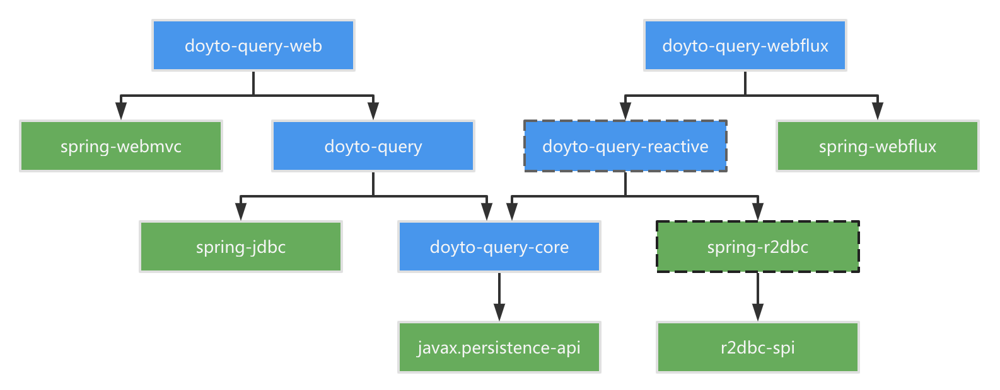

DoytoQuery -- A Java implementation for the 2nd generation ORM Framework
---

## Concepts about the 2nd generation ORM Framework

**Mapping SQL statements to objects for database access operations**

## Features
- Data access layer
  - CRUD interface `DataAccess` 
  - Dialect extension
  - Mock implementation for `DataAccess`
  - Associative Service
  - Join/GroupBy Query
  
- Service layer
  - CRUD methods
  - Second level cache
  - UserId 
  - EntityAspect extension
  
- Controller layer
  - RESTFul API
  - ErrorCode
  - Exception assertion
  - Exception handler
  - Json response wrapper
  - Request/Entity/Response transition
  - Group validation

## Related resources

- Github
  - [https://github.com/f0rb/doyto-query](https://github.com/f0rb/doyto-query)
  - [https://github.com/f0rb/doyto-query-web](https://github.com/f0rb/doyto-query-web)
  - [https://github.com/doytowin/doyto-query-dialect](https://github.com/doytowin/doyto-query-dialect)

- Projects
  - [Demo](https://github.com/f0rb/doyto-query-demo)
  - [Idea plugin](https://github.com/doytowin/doyto-query-intellij-plugin)
  - [I18n management service](https://github.com/f0rb/doyto-service-i18n)
  - [Code generator service](https://gitee.com/doyto/doyto-service-generator)

- Documentation
  -  [https://query.doyto.win/](https://query.doyto.win/)

- Architecture for 0.3.x
  
