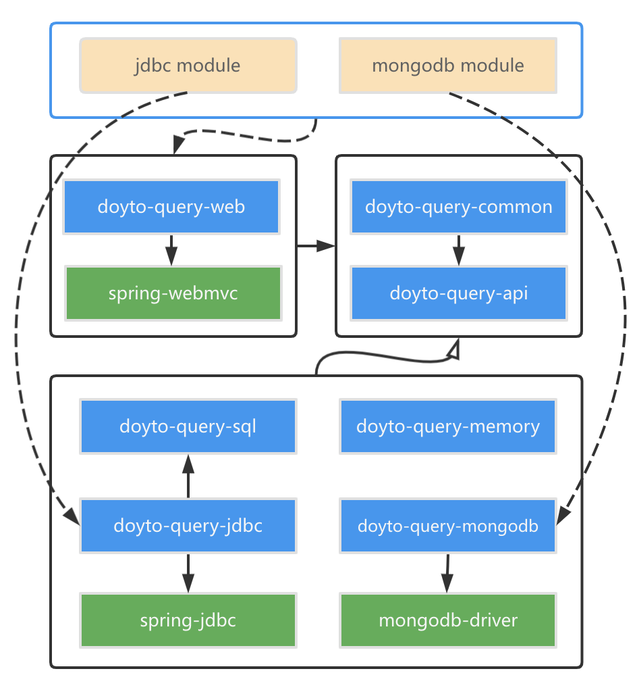

DoytoQuery - The best and the last ORM framework in Java.
---

## Introduction

DoytoQuery is a powerful and easy-to-use ORM framework in Java. 
It comes out from an idea which is mapping a query object directly to a WHERE clause in SQL to query database.
Then with the development of DoytoQuery, the idea developed into a new ORM theory.

## The Modern ORM Theory

1. We can define a query object mapping query statements.
    - For SQL, see [QueryBuilderTest](https://github.com/doytowin/doyto-query/blob/main/doyto-query-sql/src/test/java/win/doyto/query/sql/QueryBuilderTest.java)
    - For MongoDB, see [MongoFilterBuilderTest](https://github.com/doytowin/doyto-query/blob/main/doyto-query-mongodb/src/test/java/win/doyto/query/mongodb/filter/MongoFilterBuilderTest.java)
2. We can define an entity object and cooperate with the query object to complete the CRUD operations of single-table.
    - For SQL, see [CrudBuilderTest](https://github.com/doytowin/doyto-query/blob/main/doyto-query-sql/src/test/java/win/doyto/query/sql/CrudBuilderTest.java)
    - For MongoDB, see [MongoDataAccessTest](https://github.com/doytowin/doyto-query/blob/edb365345912a84ee2a0f6c2c0d757e25ba1db7a/doyto-query-mongodb/src/test/java/win/doyto/query/mongodb/MongoDataAccessTest.java)
3. **Data Manipulation Language can be classified into three categories**, corresponding to three different interfaces:
    1. CRUD for business tables: [DataAccess](https://github.com/doytowin/doyto-query/blob/main/doyto-query-api/src/main/java/win/doyto/query/core/DataAccess.java)
    2. CRD for association tables: [AssociationService](https://github.com/doytowin/doyto-query/blob/main/doyto-query-api/src/main/java/win/doyto/query/core/AssociationService.java)
    3. Aggregate/Relational query: [DataQueryClient](https://github.com/doytowin/doyto-query/blob/main/doyto-query-api/src/main/java/win/doyto/query/core/DataQueryClient.java)

## Features

- Data Access Layer
  - CRUD operations for single/sharding table.
  - CRD operations for association table.
  - Entity Query with relational entities and views.
- Service Layer
  - CRUD methods.
  - Second-Level Cache.
  - UserId Injection.
  - EntityAspect Extensions.
- Controller Layer
  - Support for RESTFul API.
  - ErrorCode Pre-definition.
  - Exception Assertion.
  - Exception Handler.
  - JsonResponse Wrapper.
  - Request/Entity/Response Transition.
  - Group Validation.
- Seamless integration with Spring WebMvc.
- Support for relational databases and MongoDB.

## Architecture for 0.3.x and newer

## Versions

| Module | Snapshot | Release |
| --- | --- | --- |
| doyto-query-geo | [![geo-snapshots-img]](https://oss.sonatype.org/content/repositories/snapshots/win/doyto/doyto-query-geo/) | [![geo-release-img]](https://search.maven.org/artifact/win.doyto/doyto-query-geo/) |
| doyto-query-api | [![api-snapshots-img]](https://oss.sonatype.org/content/repositories/snapshots/win/doyto/doyto-query-api/) | [![api-release-img]](https://search.maven.org/artifact/win.doyto/doyto-query-api/) |
| doyto-query-common | [![common-snapshots-img]](https://oss.sonatype.org/content/repositories/snapshots/win/doyto/doyto-query-common/) | [![common-release-img]](https://search.maven.org/artifact/win.doyto/doyto-query-common/) |
| doyto-query-memory | [![memory-snapshots-img]](https://oss.sonatype.org/content/repositories/snapshots/win/doyto/doyto-query-memory/) | [![memory-release-img]](https://search.maven.org/artifact/win.doyto/doyto-query-memory/) |
| doyto-query-sql | [![sql-snapshots-img]](https://oss.sonatype.org/content/repositories/snapshots/win/doyto/doyto-query-sql/) | [![sql-release-img]](https://search.maven.org/artifact/win.doyto/doyto-query-sql/) |
| doyto-query-jdbc | [![jdbc-snapshots-img]](https://oss.sonatype.org/content/repositories/snapshots/win/doyto/doyto-query-jdbc/) | [![jdbc-release-img]](https://search.maven.org/artifact/win.doyto/doyto-query-jdbc/) |
| doyto-query-mongodb | [![mongodb-snapshots-img]](https://oss.sonatype.org/content/repositories/snapshots/win/doyto/doyto-query-mongodb/) | [![mongodb-release-img]](https://search.maven.org/artifact/win.doyto/doyto-query-mongodb/) |
| doyto-query-web-common | [![web-common-snapshots-img]](https://oss.sonatype.org/content/repositories/snapshots/win/doyto/doyto-query-web-commoncommon/) | [![web-common-release-img]](https://search.maven.org/artifact/win.doyto/doyto-query-web-common/) |
| doyto-query-web | [![web-snapshots-img]](https://oss.sonatype.org/content/repositories/snapshots/win/doyto/doyto-query-web/) | [![web-release-img]](https://search.maven.org/artifact/win.doyto/doyto-query-web/) |
| doyto-query-dialect | [![dialect-snapshots-img]](https://oss.sonatype.org/content/repositories/snapshots/win/doyto/doyto-query-dialect/) | [![dialect-release-img]](https://search.maven.org/artifact/win.doyto/doyto-query-dialect/) |

## Related resources

- Github
  - [doyto-query](https://github.com/doytowin/doyto-query)
  - [doyto-query-reactive](https://github.com/doytowin/doyto-query-reactive)
  - [doyto-query-dialect](https://github.com/doytowin/doyto-query-dialect)

- Projects
  - [Demo](https://github.com/doytowin/doyto-query-demo)
  - [Idea plugin](https://github.com/doytowin/doyto-query-intellij-plugin)
  - [I18n management service](https://github.com/doytowin/doyto-service-i18n)
  - [Code generator service](https://github.com/doytowin/doyto-service-generator)

- Documentation
  -  [https://query.doyto.win/](https://query.doyto.win/)

License
-------
This project is under the [Apache Licence v2](https://www.apache.org/licenses/LICENSE-2.0).

[geo-snapshots-img]: https://img.shields.io/nexus/s/win.doyto/doyto-query-geo?color=blue&server=https%3A%2F%2Foss.sonatype.org
[geo-release-img]: https://img.shields.io/maven-central/v/win.doyto/doyto-query-geo?color=brightgreen
[api-snapshots-img]: https://img.shields.io/nexus/s/win.doyto/doyto-query-api?color=blue&server=https%3A%2F%2Foss.sonatype.org
[api-release-img]: https://img.shields.io/maven-central/v/win.doyto/doyto-query-api?color=brightgreen
[common-snapshots-img]: https://img.shields.io/nexus/s/win.doyto/doyto-query-common?color=blue&server=https%3A%2F%2Foss.sonatype.org
[common-release-img]: https://img.shields.io/maven-central/v/win.doyto/doyto-query-common?color=brightgreen
[memory-snapshots-img]: https://img.shields.io/nexus/s/win.doyto/doyto-query-memory?color=blue&server=https%3A%2F%2Foss.sonatype.org
[memory-release-img]: https://img.shields.io/maven-central/v/win.doyto/doyto-query-memory?color=brightgreen
[sql-snapshots-img]: https://img.shields.io/nexus/s/win.doyto/doyto-query-sql?color=blue&server=https%3A%2F%2Foss.sonatype.org
[sql-release-img]: https://img.shields.io/maven-central/v/win.doyto/doyto-query-sql?color=brightgreen
[jdbc-snapshots-img]: https://img.shields.io/nexus/s/win.doyto/doyto-query-jdbc?color=blue&server=https%3A%2F%2Foss.sonatype.org
[jdbc-release-img]: https://img.shields.io/maven-central/v/win.doyto/doyto-query-jdbc?color=brightgreen
[mongodb-snapshots-img]: https://img.shields.io/nexus/s/win.doyto/doyto-query-mongodb?color=blue&server=https%3A%2F%2Foss.sonatype.org
[mongodb-release-img]: https://img.shields.io/maven-central/v/win.doyto/doyto-query-mongodb?color=brightgreen
[web-common-snapshots-img]: https://img.shields.io/nexus/s/win.doyto/doyto-query-web-common?color=blue&server=https%3A%2F%2Foss.sonatype.org
[web-common-release-img]: https://img.shields.io/maven-central/v/win.doyto/doyto-query-web-common?color=brightgreen
[web-snapshots-img]: https://img.shields.io/nexus/s/win.doyto/doyto-query-web?color=blue&server=https%3A%2F%2Foss.sonatype.org
[web-release-img]: https://img.shields.io/maven-central/v/win.doyto/doyto-query-web?color=brightgreen
[dialect-snapshots-img]: https://img.shields.io/nexus/s/win.doyto/doyto-query-dialect?color=blue&server=https%3A%2F%2Foss.sonatype.org
[dialect-release-img]: https://img.shields.io/maven-central/v/win.doyto/doyto-query-dialect?color=brightgreen
