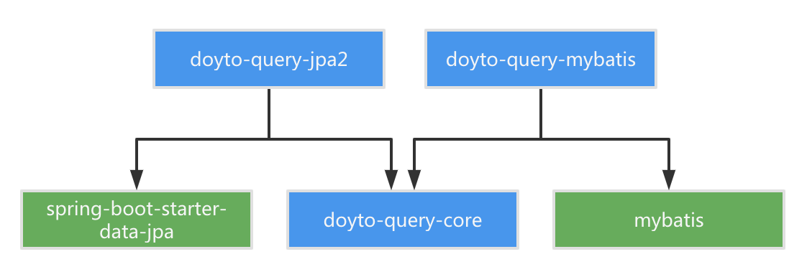
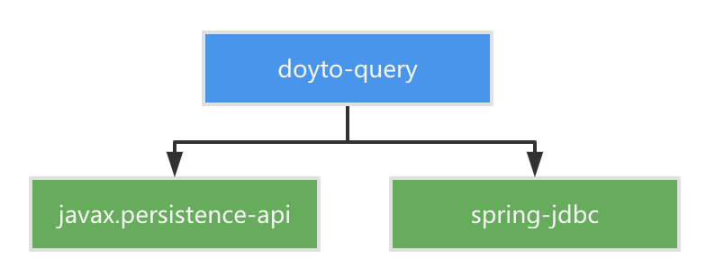
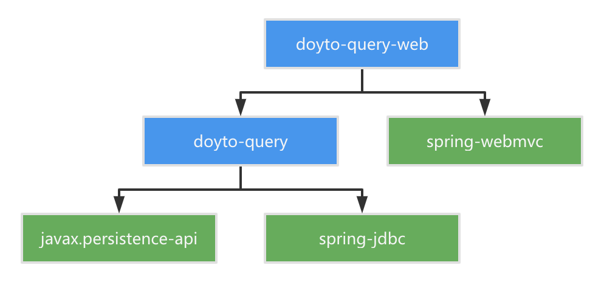
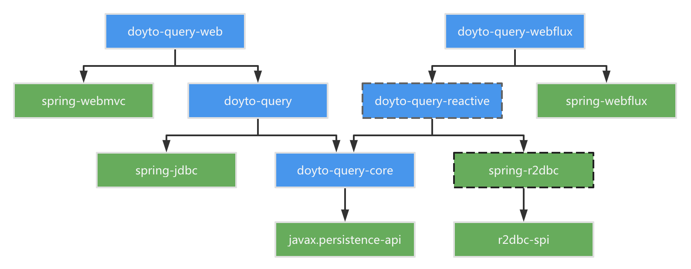
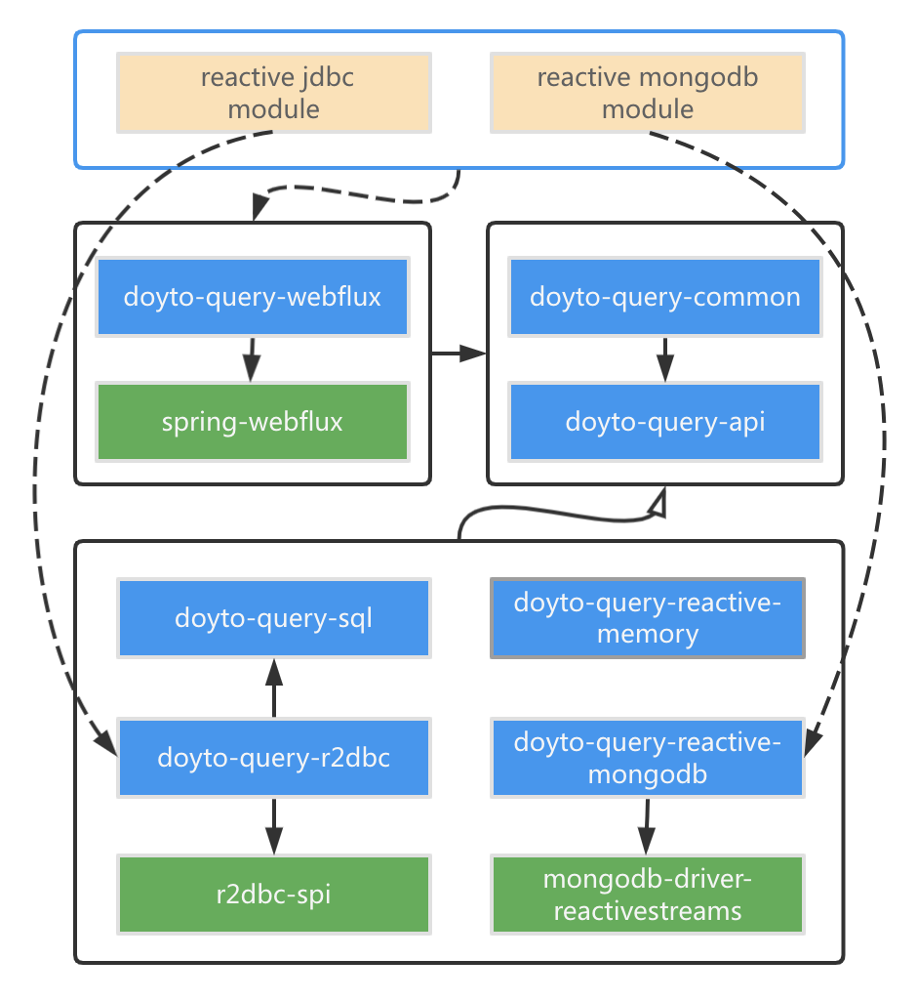

Architecture Migration for `DoytoQuery`
---

0.0.1
---
`DoytoQuery` acts as an SQL generation framework，using `SpringDataJPA` and `MyBatis` as SQL executor.

0.1.x
---
Replace `SpringDataJPA` and `MyBatis` with `spring-jdbc` due to table sharding.

0.2.x
---
Extract Controller implementation from tests to `doyto-query-web`.

0.3.x
---
Try to support both webmvc and webflux.

Support SQL and NoSQL databases.

Architecture for reactive version.

